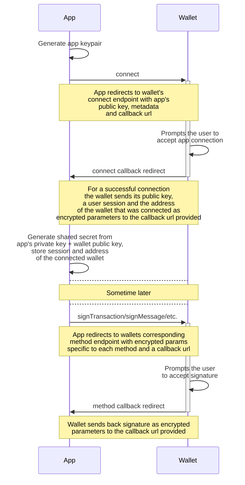

# Deeplink wallet connect

Solana wallet connector using deeplinks protocol for [Solflare](https://docs.solflare.com/solflare/technical/deeplinks) and [Phantom](https://docs.phantom.com/phantom-deeplinks/deeplinks-ios-and-android) wallets integration into mobile app environments such as react-native or web dApps running in a mobile browser where browser extensions are not available.

**Why use it ?**

Because it provides a unified way of connecting to Solana wallets from both Android and iOS.

Because [Mobile Wallet Adapter](https://docs.solanamobile.com/react-native/using_mobile_wallet_adapter) only supports Android devices for native apps and only dApps running in Chrome browser.

- [Overview](#overview)
- [TODO](#todo)
- [Packages](#packages)
- [How to use](#how-to-use)
- [Examples](#examples)
- [Changelog](#changelog)
- [Known issues](#known-issues)
---

> **WARNING:** Not yet production ready, work in progress, use at your own risk.
---

## Overview

Deeplinks work via redirects, so only the App or Wallet is visible to the user at one time. The App has no control or feedback after a deeplink redirect, only when the Wallet redirects back it can evaluate the status of the call. However, the user can still close the Wallet app or switch back to the App making for a not so friendly user experience.

During the connect phase App and Wallet exchange public keys used to encrypt the communicated data using symmetric key encryption generated from a Diffie-Hellman key exchange. A **shared secret** is generated for encryption and decryption, on App side by using **App's private key** and the **Wallet public key** returned in the connect phase.



One of the challenges is to be able to handle the callback urls in the App and return the user to the previous context.

## TODO

- [ ] Implement remaining methods:
  - [X] SignTransaction
  - [ ] SignAllTransactions
  - [ ] SignAndSendTransaction
- [ ] Implement wallet adapter connector
- [ ] Implement [Seed Vault](https://docs.solanamobile.com/developers/seed-vault) for Saga and Seeker devices
- [ ] Examples
  - [X] react-native expo app
  - [ ] next.js app with wallet adapter
  - [ ] next.js app with wallet-lib only

## Packages
1. `@biqprotocol/wallet-lib` - TS only lib for manual integration or advanced usage
2. `@biqprotocol/wallet-react-native` - react native expo context provider and callback handler
3. TODO - [wallet adapter](https://github.com/anza-xyz/wallet-adapter) connector for react + next.js apps

## How to use

This library was build for integration into a react-native expo app that uses expo-router for navigation. This is the recommended use case, but more advanced use cases will be possible in the future.

**1. Install library and dependencies**
```sh
npm i @biqprotocol/wallet-react-native
```

You also need to provide peer dependencies if you don't already have them in your app:
```sh
npm i expo-linking expo-router expo-secure-store react-native-get-random-values
```

> `react-native-get-random-values` is required in the app as it contains native modules that are not linked by expo unless they are present in the app's package.json 

Make sure to also configure expo-router and expo-secure-store as plugins in your app.json if you have not done that already:

```json
...
  "plugins": [
    ...
    "expo-router",
    [
      "expo-secure-store",
      {
        "configureAndroidBackup": true,
        "faceIDPermission": "Allow $(PRODUCT_NAME) to access your Face ID biometric data."
      }
    ]
    ...
  ],
...
```

**2. Configure context**

Add and configure the `SolanaWallet` context in your root _layout.tsx (usually **src/app/_layout.tsx**) file wrapping your existing content:
```ts
import { SolanaWallet } from "@biqprotocol/wallet-react-native";

...

export default function RootLayout() {
  ...
  return (
    <SolanaWallet appUrl="https://www.biq.me" appScheme="me.biq.app" cluster="mainnet-beta">
      ...
    </SolanaWallet>
  )
}
```

`SolanaWallet` configuration options:
- `appUrl` - URL used by wallets to extract app metadata, see [Display apps](https://docs.phantom.com/best-practices/displaying-your-app)
- `appScheme` - [optional] URL scheme to use for redirect URLs (see [Expo Linking `createURL`](https://docs.expo.dev/versions/latest/sdk/linking/#linkingcreateurlpath-namedparameters))
- `cluster` - [optional] Solana cluster to use ("mainnet-beta", "devnet" or "testnet")

**3. Setup callback catch-all route**

Create **src/app/solanawallet/[...params].tsx** file with the following content:
```ts
import { SolanaWalletScreen } from "@biqprotocol/wallet-react-native";

export default SolanaWalletScreen;
```

**4. Integrate the wallet in your app**

```ts
import { SolanaWalletContext, SolanaWalletProvider } from "@biqprotocol/wallet-react-native";
import { Pressable, Text, View } from "react-native";
...

export default function MyScreen() {
  ...
  const [connectedWallet, setConnectedWallet] = useState<string>();
  const [lastSignature, setLastSignature] = useState<string>();
  const { solanaWallet } = useContext(SolanaWalletContext);

  ...

  const handleWalletConnect = useCallback(async (provider: SolanaWalletProvider) => {
    const wallet = await solanaWallet!.connect(provider);
    if (typeof wallet !== "undefined") {
      setConnectedWallet(wallet.address);
    }
  }, [solanaWallet]);

  const handleWalletSignMessage = useCallback(async (message: string) => {
    if (typeof connectedWallet !== "undefined") {
      const signature = await solanaWallet!.signMessage(connectedWallet, message);
      if (typeof signature !== "undefined") {
        setLastSignature(signature);
      }
    }
  }, [solanaWallet, connectedWallet]);

  ...

  return (
    ...
      <Pressable onPress={() => handleWalletConnect(SolanaWalletProvider.SOLFLARE)}>
        <Text>Connect Solflare wallet</Text>
      </Pressable>
      <View>
        <Text>{connectedWallet}</Text>
      </View>

      <Pressable onPress={() => handleWalletSignMessage("Hello from myApp!")}>
        <Text>Sign a message</Text>
      </Pressable>
      <View>
        <Text>{lastSignature}</Text>
      </View>
    ...
  )
}
```

## Examples

See react-native expo example app in [examples/react-native-app](./examples/react-native-app/).

To run locally, install dependencies and run `npm run android` or `npm run ios` with a device connected (or on emulators). Make sure you have the wallet apps installed and configured on the device.

## Changelog

- **2025-08-31**
  - Add signTransaction method
  - `@biqprotocol/wallet-lib` v0.0.8
  - `@biqprotocol/wallet-react-native` v0.0.14

- **2025-08-30**
  - Some dependency fixes
  - Example react-native expo app
  - `@biqprotocol/wallet-lib` v0.0.7
  - `@biqprotocol/wallet-react-native` v0.0.13

- **2025-08-29** 
  - Initial POC release
  - `@biqprotocol/wallet-lib` v0.0.6
  - `@biqprotocol/wallet-react-native` v0.0.12

## Known issues

Solflare has some issues, most can be work around depending on your use case. See [docs/SOLFLARE.md](./docs/SOLFLARE.md) for details.

